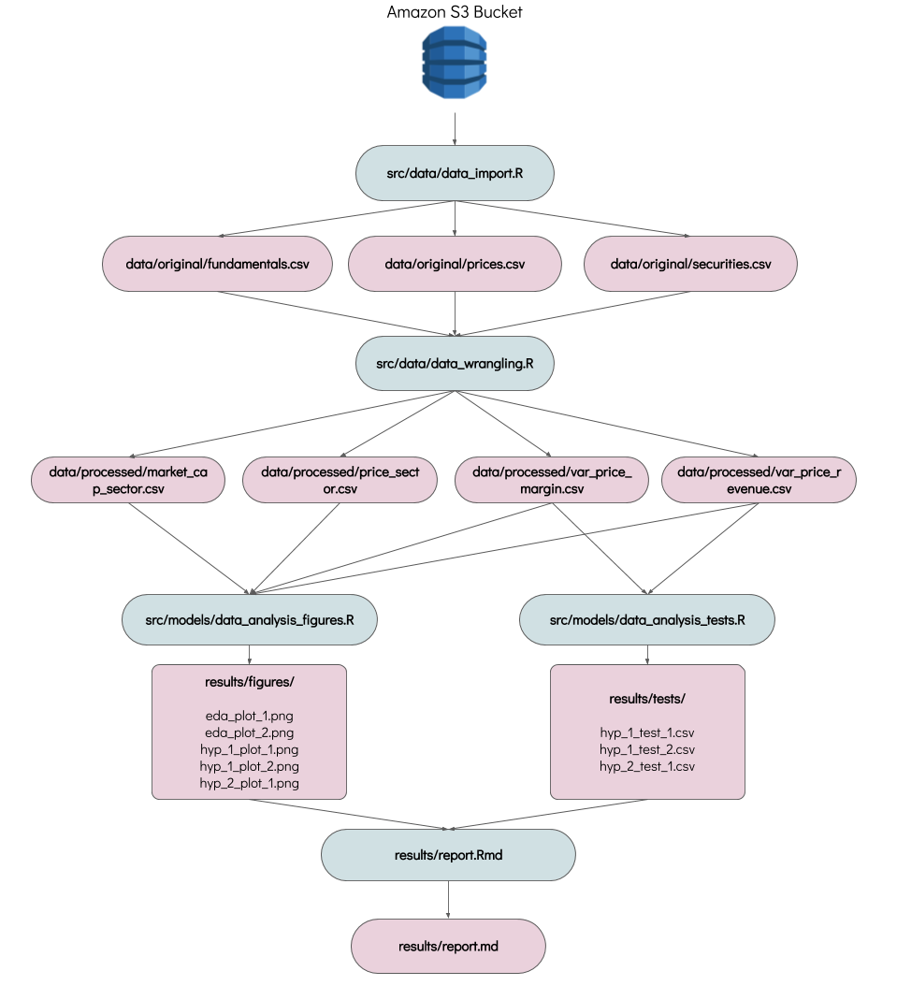

# Investment Analysis
The purpose of this data analysis project is identifying some patterns of successful and unsuccessful companies in the Standard & Poors index. The S&P 500 is an index of 505 companies in the United States stock market which have a market capitalization of at least $6.1 billion. In other words, it's a group of the most relevant public companies in the United States.

[More information about the S&P 500](https://www.investopedia.com/terms/s/sp500.asp)

This patterns can help us to select them or discard them from our portfolio. There are two approaches to making investment decisions:

- **Fundamental analysis:** takes the real business indicators from a company to help decide about investments. This is the approach investors like Warren Buffet use, contrasting the real situation of the business with its temporal price in the market. If a company has solid indicators and they aren't reflected in the stock price, there's a temporal opportunity for creating wealth from that difference.

- **Technical analysis:** tries to find patterns in the time series of prices. It's focused in the short term. For this project, all my analysis will be fundamental, based on the financial information of the companies and not the technical analysis.

[More information about Fundamental vs Technical Analysis ](https://www.investopedia.com/university/technical/techanalysis2.asp)

## Question

> Common sense is not so common -Voltaire

Using common sense, we can say that a company is good if it sells a lot, increases its sales and gives some profit from those sales. I want to analyze with this project if this common-sense assumption is also applied in the stock market, in other words:

Companies that increase their sales and their profits also increase their stock price?


## Hypotheses

For this project I will try to test some hypothesis about the companies in the S&P 500:

1. Companies that increase their revenue year on year also increase their stock price.

2. Companies with high profitability have high investment returns for stockholders.

These hypotheses are general and can give us a snapshot of internal business variables that affect the performance of a stock in the market. In the future, the idea with this project is going to another level of fundamental analysis. I want to find the relation between the quality of the people leading a business and the results of the companies and also analyzing the official communications using NLP.

## Plan of Action

This data analysis project will follow the following steps:

1. **Download the financial data from the last four years of the S&P**. This includes three tables of data: the list of companies with their profile information, the financial statements for these companies in the last four years and the price history of the stocks in the index for the last four years.

2. **Exploratory data analysis**: this part of the analysis includes some general plots and analysis of the results of the companies in the S&P 500 index and the evolution in the stock prices.

3. **Hypothesis validation**: each hypothesis will be analyzed on separate scripts. The idea is performing some data wrangling with the raw data and using scatter plots and box plots to identify some underlying relations between the variables. Then performing some linear regression tests to find the relations between the variables.

4. **Results report**: the results of the EDA and the hypothesis validation will be stored in a final document.

PS: In the `src` folder in the repository I started the scripts for steps 1 - 3.

## Data Sources

The data sources used for this project come from the [Kaggle's New York Stock Exchange Dataset](https://www.kaggle.com/dgawlik/nyse/data). For the convenience of the user these datasets are hosted on an Amazon S3 Bucket. This project includes three datasets with connections between them:

1. [Securities](https://s3.ca-central-1.amazonaws.com/investment-analysis/securities.csv): includes the list of the companies that 
2. [Fundamentals](https://s3.ca-central-1.amazonaws.com/investment-analysis/fundamentals.csv): includes the financial statements (income statement, balance sheet and cashflow) of the companies listed in the S&P 500 for the last 5 years.
3. [Prices](https://s3.ca-central-1.amazonaws.com/investment-analysis/prices-split-adjusted.csv): includes the daily price (open, high, low and close) for each company in the last 5 years in the S&P 500.

## Analysis Flowchart



## Usage

First clone this GitHub repository. Then go to the terminal and from the `root` execute the following command:

`bash run_all.sh`

This script executes all the scripts necessary for creating the final report.

You can also execute each of the scripts independently but you must follow this order:

- **data_import.r**

```
Rscript src/data/data_import.R fundamentals prices securities data/original/fundamentals.csv data/original/prices.csv data/original/securities.csv
```

- **data_wrangling.r**

```
Rscript src/data/data_wrangling.R data/original/fundamentals.csv data/original/prices.csv data/original/securities.csv data/processed/var_price_revenue.csv data/processed/var_price_margin.csv data/processed/price_sector.csv data/processed/market_cap_sector.csv
```

- **data\_analysis_figures.r**

```
Rscript src/models/data_analysis_figures.R data/processed/var_price_revenue.csv data/processed/var_price_margin.csv data/processed/price_sector.csv data/processed/market_cap_sector.csv results/figures/hyp_1_plot_1.png results/figures/hyp_1_plot_2.png results/figures/hyp_2_plot_1.png results/figures/eda_plot_1.png results/figures/eda_plot_2.png
```

- **data\_analysis_tests.r**

```
Rscript src/models/data_analysis_tests.R data/processed/var_price_revenue.csv data/processed/var_price_margin.csv results/tests/hyp_1_test_1.csv results/tests/hyp_1_test_2.csv results/tests/hyp_2_test_1.csv
```

- **run_report.sh**

```
bash run_report.sh
```

This execution will be automated with a Makefile in the 3rd release, for now the paths seems long but is just copying and pasting them in the terminal!

## Dependencies

For running this project you should have:

- R and RStudio.
- `tidyverse` and `ezknitr`libraries.