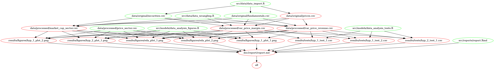

# Investment Analysis
The purpose of this data analysis project is identifying some patterns of successful and unsuccessful companies in the Standard & Poors index. The S&P 500 is an index of 505 companies in the United States stock market which have a market capitalization of at least $6.1 billion. In other words, it's a group of the most relevant public companies.

[More information about the S&P 500](https://www.investopedia.com/terms/s/sp500.asp)

This patterns can help us select or discard companies from our portfolio. There are two approaches for making investment decisions:

- **Fundamental analysis:** takes the real business indicators from a company to help us decide about investments. This is the approach investors like Warren Buffet use, contrasting the real situation of the business with its stock price in the market. If a company has solid indicators and they aren't reflected in the stock price, there's an opportunity for creating wealth from that difference.

- **Technical analysis:** tries to find patterns in the time series of prices. It's focused in the short term. For this project, all my analysis will be fundamental, based on the financial information of the companies and not the technical analysis.

[More information about Fundamental vs Technical Analysis ](https://www.investopedia.com/university/technical/techanalysis2.asp)

## Question

> Common sense is not so common -Voltaire

Using common sense, we can say that a company is good if it sells a lot, increases its revenue year on year and gives some profit from those sales. I want to analyze with this project if this common-sense assumption is also applied in the stock market, in other words:

Companies that increase their sales and their profits also increase their stock price?

## Hypotheses

For this project I will try to test some hypothesis about the companies in the S&P 500:

1. Companies that increase their revenue year on year also increase their stock price.

2. Companies with high profitability have high investment returns for stockholders.

These hypotheses are general and can give us a snapshot of internal business variables that affect the performance of a stock in the market. In the future, the idea with this project is going to another level of fundamental analysis. I want to find the relationship between the quality of the people leading a business and its results and also analyze their official communications using NLP.

## Process

This data analysis project follows the following steps:

1. **Download the financial data from the last four years of the S&P**. This includes three tables of data: the list of companies with their profile information, their financial statements from the last four years and their stock price history in the last four years.

2. **Exploratory data analysis**: this part of the analysis includes some general plots and analysis of the results of the companies in the S&P 500 index divided by sectors.

3. **Hypothesis validation**: each hypothesis was analyzed on separate scripts. Each script executes some data wrangling with the raw data and creates scatter plots and box plots to identify some underlying relations between the variables. Also, there are other scripts for performing some linear regression tests to find the relations between the variables.

4. **Results report**: the results of the EDA and the hypothesis validation are stored in the `doc/report/report.md` document.

## Data Sources

The data sources used for this project come from the [Kaggle's New York Stock Exchange Dataset](https://www.kaggle.com/dgawlik/nyse/data). For the convenience of the user these datasets are hosted on an Amazon S3 Bucket. This project includes three datasets with connections between them:

1. [Securities](https://s3.ca-central-1.amazonaws.com/investment-analysis/securities.csv): includes the list of the companies that 
2. [Fundamentals](https://s3.ca-central-1.amazonaws.com/investment-analysis/fundamentals.csv): includes the financial statements (income statement, balance sheet and cashflow) of the companies listed in the S&P 500 for the last 5 years.
3. [Prices](https://s3.ca-central-1.amazonaws.com/investment-analysis/prices-split-adjusted.csv): includes the daily price (open, high, low and close) for each company in the last 5 years in the S&P 500.

## Usage

I recommend the following flow for executing this project:

1. Clone this repository:

	`git clone https://github.com/estebanangelm/investment_analysis.git`

2. Run Docker and execute the following command in the terminal for downloading the image

	`docker pull estebanangelm/investment_analysis`
	
3. Run the Docker image and link it to your local version of the repository:

	`docker run -it --rm -v local_directory_of_this_repo:/investment_analysis estebanangelm/investment_analysis /bin/bash`
	
4. From the root in the Docker container go to the `investment_analysis` folder and run the following command:

	`make all`
	
5. And for cleaning all the files of the analysis:

	`make clean`
	

### Alternative usage

An alternative way of running this project is running the Make file from the root of the directory:

`make all`

And for cleaning the directory after running the analysis:

`make clean`

## Dependencies

Due to the quantity of plots and tests, the Makefile diagram is not clear. It's recommended to zoom in or open it on a new browser window:

For running this project without using the Docker container you should have:

- R and RStudio.
- `packrat`