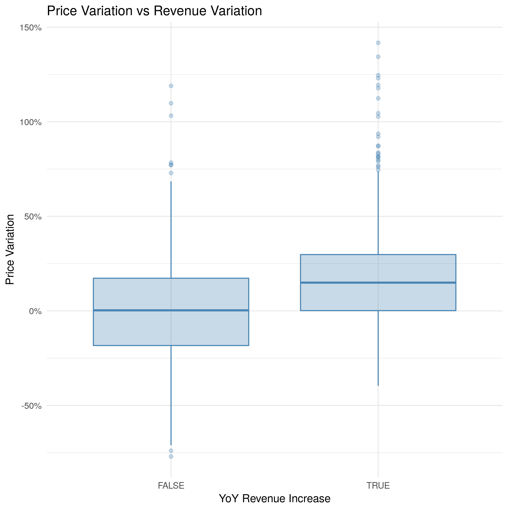

```{r setup, include=FALSE}
knitr::opts_chunk$set(echo = TRUE)
```
# Investment Analysis Report

```{r message=FALSE,warning=FALSE,echo=FALSE}
library(tidyverse)
library(knitr)
```

The purpose of this data analysis project is identifying some patterns of successful and unsuccessful companies in the Standard & Poors index. The S&P 500 is an index of 505 companies in the United States stock market which have a market capitalization of at least $6.1 billion. In other words, it's a group of the most relevant public companies in the United States.

[More information about the S&P 500](https://www.investopedia.com/terms/s/sp500.asp)

This patterns can help us to select them or discard them from our portfolio. There are two approaches to making investment decisions:

- **Fundamental analysis:** takes the real business indicators from a company to help decide about investments. This is the approach investors like Warren Buffet use, contrasting the real situation of the business with its temporal price in the market. If a company has solid indicators and they aren't reflected in the stock price, there's a temporal opportunity for creating wealth from that difference.

- **Technical analysis:** tries to find patterns in the time series of prices. It's focused in the short term. For this project, all my analysis will be fundamental, based on the financial information of the companies and not the technical analysis.

[More information about Fundamental vs Technical Analysis ](https://www.investopedia.com/university/technical/techanalysis2.asp)

## Question

> Common sense is not so common -Voltaire

Using common sense, we can say that a company is good if it sells a lot, increases its sales and gives some profit from those sales. I want to analyze with this project if this common-sense assumption is also applied in the stock market, in other words:

Companies that increase their sales and their profits also increase their stock price?


## Hypotheses

For this project I will try to test some hypothesis about the companies in the S&P 500:

1. Companies that increase their revenue year on year also increase their stock price.

2. Companies with high profitability have high investment returns for stockholders.

These hypotheses are general and can give us a snapshot of internal business variables that affect the performance of a stock in the market. In the future, the idea with this project is going to another level of fundamental analysis. I want to find the relation between the quality of the people leading a business and the results of the companies and also analyzing the official communications using NLP.

## Results

The first step of the analysis was understanding better the structure of the S&P 500 and the types of companies that make part of it. For analyzing this, we use the variable `market cap`, which is just the total value for all the companies in each sector. We can calculate the market capitalization with the following formula:

$$MarketCap = TotalShares * PricePerShare$$
When we add up the `market_cap` for all the companies in each sector of the S&P 500, we can have a general picture of the most important and less important sectors that compose it. I summarized them in the following plot:


We can see that Financials, Healthcare and IT companies dominate the index. Additional to the `market_cap` per sector, it's relevant to know the performance of the different companies that compose each sector. For analyzing this, I plotted all the individual year on year returns for all the companies that comprise each sector:


We can see that the IT sector slightly outperforms the rest of the sectors and Energy is underperforming compared to the rest. After this overview of the S&P index, we start analyzing the two hypothesis of this project.

## Hypothesis 1

Using common sense, we would say that a company is in a good situation if it increases its sales and in a bad situation if those sales decrease year on year. Most of the times things are more complicated because behind the variation in revenue other factors can affect the future of a company. But assuming that the rest of the variables are held constant, we can plot the changes in revenue per company in the S&P 500 year on year vs the variation in the stock price in that same period. We get the following scatterplot which shows a slight linear relationship:


Additional to the visual analysis, I fitted a simple linear model comparing these variations in price with the changes in revenue:

```{r warning=FALSE,message=FALSE,echo=FALSE}
knitr::kable(read_csv(file = 'results/tests/hyp_1_test_1.csv'),format = "markdown")
```

From the previous linear model, we can see that the slope term is significant. Thus we can say that there's a positive linear relationship between the variation in profits and the variation in the stock price. In other words, if a company increases the revenue by 1%, holding the rest of the variables constant, the stock price of that company increases a 0.5%. The same occurs with negative variations in revenue.

We can also visualize and group the different stocks with the following behaviors:

```{r warning=FALSE,message=FALSE,echo=FALSE}
knitr::kable(read_csv(file = 'results/tests/hyp_1_test_2.csv'),format = "markdown")
```
With the previous table, we can see that a 67% of the observations have an effect in price coherent with what we found in the linear model. We can group and visualize the results from the previous table also with the following plot:


With this plot, we can see that the mean price variation and also most the price variation of most of the observations in the group of companies with a revenue increase are higher than the ones in with decreasing revenue.
Now that we validated Hypothesis 1, we can continue analyzing hypothesis 2.


## Hypothesis 2

Additional to increasing sales, a company should leave some profit from that revenue. The purpose of this hypothesis is finding if there's a relation between the market price and the profit these companies have. For this case, I used the `operating_margin`, which is one of the financial measures of profitability. This indicator is calculated dividing the operating profit (Revenue - Costs - Operating Expenses) by the total revenue. Companies with high `operating_margin` leave a nice amount of money per each dollar sold.

The approach for testing this hypothesis was similar to hypothesis 1, starting with a scatterplot between both variables and fitting a linear model assuming that the rest of the variables are held constant:


In this case, when we compare the `operating_margin` with the `price_variation` it's hard to identify a trend. Observations with different `operating_margin` are distributed along the y-axis uniformly, which makes it hard to identify a relation between both variables. The next step is fitting a simple linear model that can help us to understand this strange plot:

```{r warning=FALSE,message=FALSE,echo=FALSE}
knitr::kable(read_csv(file = 'results/tests/hyp_2_test_1.csv'),format = "markdown")
```
In this case, we still get a significant slope, and something curious happens, the estimate is negative, which can be interpreted that on each increase in the operating margin of a company, its stock price will fall. 

Eventhough the linear relationship is significant, if we see the magnitude of the estimate (0.001) we can say that the effect is not relevant, because we're saying that if we increase the operating margin by 1% (one percent in a billion dollar company is a lot of money), the price of that stock falls -0.11%.

## Conclusion

In reality, there are thousands of variables related to the performance of a stock in the market. The stock market is a combination of emotions that get translated into financial operations, so any of these variables can affect those emotions and change the prices. For this analysis, I focused on simple variables of the results of the companies, but even though they are simple, they reflect a lot of what's occurring inside a company.

Sometimes hedge funds and investors get into complex methods for identifying opportunities of making money and the market and forget the simple stuff like that a company needs to increase its sales year on year for being sustainable and keep returning profits, which at the end are reflected in the prices.

## Next steps

For the next version of this analysis, I want to keep focusing on the simple things about companies and that the most successful investors like Warren Buffet focus. I want to reflect this opportunity in a reproducible analysis which can be executed each time we want to decide what to buy or sell.
